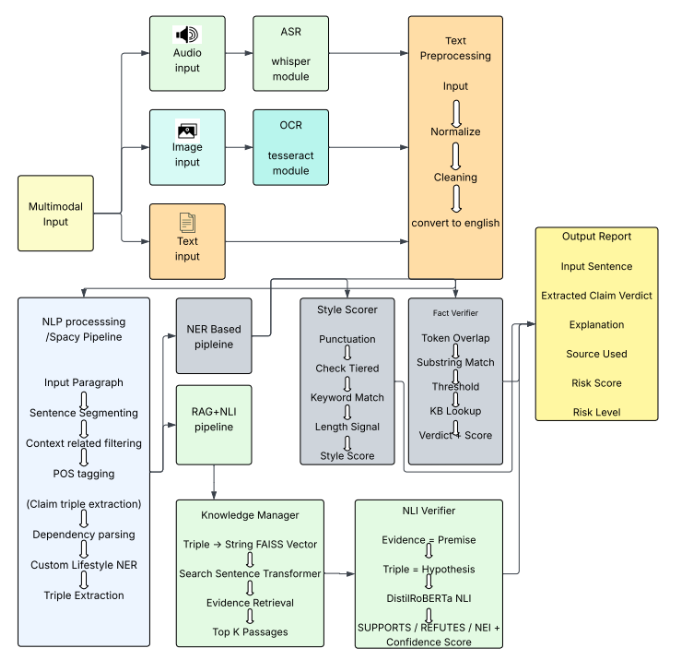

# TruthCheck – Multimodal Health Misinformation Detection System

This repository contains a **complete health misinformation detection pipeline** for Indian contexts.
It supports **text, image, and voice inputs** and provides end-to-end analysis including claim extraction, fact verification, and risk assessment.

---

## 📌 Features Implemented

### Input Processing
* Text input handling
* OCR for images (English + Hindi) using Tesseract
* ASR for voice notes (Hindi / Hinglish / English) using Whisper
* Text normalization and preprocessing

### Language Processing
* Language detection (fastText)
* Hinglish to English translation (googletrans)
* Custom Lifestyle NER with spaCy

### Analysis Pipeline
* Claim extraction (Subject-Relation-Object triples)
* Linguistic style scoring (detects sensationalism, clickbait)
* Fact verification against knowledge base
* Risk assessment engine
* Baseline ML classifier (TF-IDF + Logistic Regression)

---

## 🧱 Project Structure

```
TruthCheck/
│
├── data/
│   ├── raw_inputs/              # Input images / audio files
│   ├── extracted_text/         # (Optional) saved outputs
│   ├── train.csv               # Training dataset
│   ├── verified_facts.json     # Knowledge base for fact verification
│   └── lifestyle_patterns.jsonl # Custom NER patterns
│
├── logs/                       # Debug and pipeline logs
│
├── models/
│   └── language/
│       └── lid.176.bin         # fastText language ID model (download separately)
│
├── pipeline/
│   ├── text_input.py           # Text passthrough
│   ├── ocr.py                  # Image → Text (Tesseract)
│   ├── asr.py                  # Audio → Text (Whisper)
│   ├── normalize.py            # Text normalization
│   ├── lang_detect.py          # Language detection
│   ├── hinglish.py             # Hinglish tagging
│   └── dataset.py              # Dataset loading utilities
│
├── src/
│   ├── preprocessor.py         # Hinglish translation and preprocessing
│   ├── claim_extractor.py      # Basic triple extraction
│   ├── refine_extractor.py     # Advanced claim extraction
│   ├── lifestyle_ner.py        # Custom lifestyle entity recognition
│   ├── linguistic_scorer.py   # Style-based risk scoring
│   ├── verifier.py             # Fact verification engine
│   └── risk_engine.py          # Final risk calculation
│
├── main.py                     # Main pipeline entry point
├── train_baseline.py           # Baseline ML classifier training
├── config.py                   # Configuration settings
└── README.md
```

---

## 🛠 Requirements

### System Requirements

* **Windows 10/11**
* **Python 3.11.x** (recommended)
* **FFmpeg** (required for ASR/Whisper audio processing)
* **Tesseract OCR** (required for image text extraction)

---

### Python Packages

Install all dependencies inside a virtual environment:

```bash
# Core ML and Deep Learning
pip install torch --index-url https://download.pytorch.org/whl/cpu
pip install "numpy<2"

# Audio Processing (ASR)
pip install openai-whisper

# Image Processing (OCR)
pip install pytesseract
pip install pillow

# Language Processing
pip install fasttext
pip install googletrans
pip install spacy

# Machine Learning
pip install scikit-learn
pip install pandas

# Standard library dependencies (usually pre-installed)
# - re (regex)
# - json
# - os
```

### spaCy Language Model

After installing spaCy, download the English language model:

```bash
python -m spacy download en_core_web_sm
```

---

### External Dependencies

#### 1️⃣ Tesseract OCR

**Required for:** Image text extraction (OCR)

* Download from: [https://github.com/UB-Mannheim/tesseract/wiki](https://github.com/UB-Mannheim/tesseract/wiki)
* Install **English** and **Hindi** language packs during installation
* Default installation path (used in `pipeline/ocr.py`):

```
C:\Program Files\Tesseract-OCR\tesseract.exe
```

* If installed elsewhere, update the path in `pipeline/ocr.py`:

```python
pytesseract.pytesseract.tesseract_cmd = r"YOUR_PATH\tesseract.exe"
```

---

#### 2️⃣ FFmpeg

**Required for:** Audio processing (Whisper ASR)

* Download from: [https://ffmpeg.org/download.html](https://ffmpeg.org/download.html)
* Add FFmpeg to system PATH
* Verify installation:

```bash
ffmpeg -version
```

---

#### 3️⃣ fastText Language Model

**Required for:** Language detection

Download the pretrained language identification model (125 MB):

👉 [https://dl.fbaipublicfiles.com/fasttext/supervised-models/lid.176.bin](https://dl.fbaipublicfiles.com/fasttext/supervised-models/lid.176.bin)

**Place it at:**

```
models/language/lid.176.bin
```

⚠️ **Note:** This file is too large for Git and is excluded via `.gitignore`. You must download it manually.

## 🚀 Installation & Setup

### Step 1: Create Virtual Environment

```bash
py -3.11 -m venv venv
venv\Scripts\activate
```

### Step 2: Install Python Dependencies

```bash
# Install PyTorch (CPU version)
pip install torch --index-url https://download.pytorch.org/whl/cpu

# Install other packages
pip install "numpy<2" openai-whisper pytesseract pillow fasttext googletrans spacy scikit-learn pandas

# Download spaCy English model
python -m spacy download en_core_web_sm
```

### Step 3: Install External Dependencies

1. **Tesseract OCR**: Download and install from [UB-Mannheim Tesseract](https://github.com/UB-Mannheim/tesseract/wiki)
   - Ensure English and Hindi language packs are installed

2. **FFmpeg**: Download from [FFmpeg.org](https://ffmpeg.org/download.html) and add to PATH

3. **fastText Model**: Download `lid.176.bin` from [fastText Models](https://dl.fbaipublicfiles.com/fasttext/supervised-models/lid.176.bin)
   - Place in `models/language/lid.176.bin`

### Step 4: Prepare Data Files (Optional)

Create the following data files if they don't exist:

* `data/verified_facts.json` - Knowledge base for fact verification
* `data/lifestyle_patterns.jsonl` - Custom NER patterns for lifestyle entities
* `data/train.csv` - Training dataset (for baseline classifier)

---

## 🚀 How to Run

### Main Pipeline

Run the complete analysis pipeline:

```bash
python main.py
```

The pipeline will:
1. Process input text (supports Hinglish)
2. Extract health claims (Subject-Relation-Object triples)
3. Score linguistic style (sensationalism detection)
4. Verify facts against knowledge base
5. Calculate final risk score

### Training Baseline Classifier

To train the baseline TF-IDF + Logistic Regression model:

```bash
python train_baseline.py
```

Requires `data/train.csv` with columns: `text` and `risk_label`

---

## ✅ Expected Output

### Main Pipeline Output

```
--- Initializing TruthCheck Engine ---
--- Pipeline Ready ---

REPORT FOR: 'Subah khali pet drinking warm water improves digestion!!!'
Claim: drinking warm water -> improves -> digestion
Verdict: TRUE
Risk: 0.09 (LOW RISK / LIKELY SAFE)
Scientific Truth: Warm water aids digestion and blood circulation.
--------------------------------------------------
```

### Pipeline Components

The system processes:
* **Input**: Raw text (English, Hindi, or Hinglish)
* **Translation**: Hinglish → English (if needed)
* **Extraction**: Health claims as triples
* **Verification**: Fact-checking against knowledge base
* **Scoring**: Linguistic style analysis
* **Risk Assessment**: Combined risk score and label

---

## ⚠️ Known Warnings (Safe to Ignore)

```
FP16 is not supported on CPU; using FP32 instead
```

This is expected when running Whisper on CPU and does not affect correctness.

---

## 📍 Current Project Status

### ✅ Completed Features

* ✔ Multimodal input processing (Text, Image, Audio)
* ✔ Language detection and Hinglish translation
* ✔ Claim extraction (Subject-Relation-Object triples)
* ✔ Custom Lifestyle NER with spaCy
* ✔ Linguistic style scoring (sensationalism detection)
* ✔ Fact verification engine
* ✔ Risk assessment system
* ✔ Baseline ML classifier (TF-IDF + Logistic Regression)

### 🔄 In Progress / Future Work

* ⏳ Enhanced knowledge base expansion
* ⏳ Transformer-based fine-tuning (MuRIL / IndicBERT)
* ⏳ Android Share Sheet integration
* ⏳ Web API deployment

---

## 🧠 Design Philosophy

* **Real-world focus**: Handles noisy, mixed-language inputs (Hinglish)
* **Preservation over correction**: Maintains original text characteristics for style analysis
* **Modular architecture**: Clean separation between preprocessing, extraction, and verification
* **Knowledge-driven**: Fact verification against curated medical knowledge base
* **Multi-signal risk assessment**: Combines linguistic style and factual accuracy

---

## 📦 Dependencies Summary

### Python Packages (Complete List)

| Package | Purpose | Version |
|---------|---------|---------|
| `torch` | Deep learning backend for Whisper | Latest (CPU) |
| `numpy` | Numerical operations | <2.0 |
| `openai-whisper` | Automatic Speech Recognition | Latest |
| `pytesseract` | OCR wrapper for Tesseract | Latest |
| `pillow` | Image processing | Latest |
| `fasttext` | Language detection | Latest |
| `googletrans` | Hinglish translation | Latest |
| `spacy` | NLP and entity recognition | Latest |
| `scikit-learn` | ML classifier | Latest |
| `pandas` | Data handling | Latest |

### External Tools

| Tool | Purpose | Required |
|------|---------|----------|
| Tesseract OCR | Image text extraction | ✅ Yes |
| FFmpeg | Audio processing | ✅ Yes |
| fastText model | Language detection | ✅ Yes (download separately) |
| spaCy model | English NLP | ✅ Yes (`en_core_web_sm`) |

---

## 📌 Project Architecture

The pipeline follows this flow:

```
Input (Text/Image/Audio)
    ↓
[Preprocessing]
    ├─ OCR (images) / ASR (audio)
    ├─ Language Detection
    └─ Hinglish Translation
    ↓
[Claim Extraction]
    ├─ Custom Lifestyle NER
    └─ Subject-Relation-Object Triples
    ↓
[Analysis]
    ├─ Linguistic Style Scoring
    └─ Fact Verification
    ↓
[Risk Assessment]
    └─ Combined Risk Score & Label
    ↓
Output Report


```

---